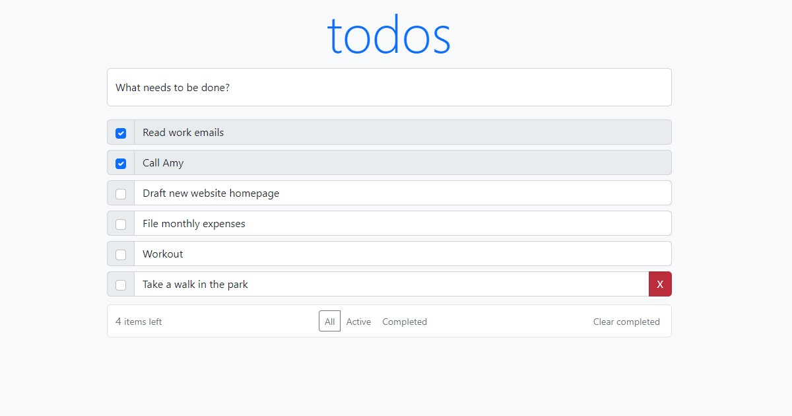

# React Todo App

### CI, tests and linter status:

## About
✅React Todo application built with React (with hooks), Redux (@redux/toolkit) with adaptive layout using Bootstrap + Formik + Playwright tests + Docker
### [Link on deployed project](bogdan-ho.github.io/todo-list/)

## Getting Started
- Clone a repository
- Go to the working directory of the project `cd todo-list`
- Run `make app-setup`
- Run tests `make app-test`
- Start the server `make up`

## Features
- Adding, Editing, Deleting and marking Completed tasks
- Filter tasks by All, Active, Completed
- Clear all completed tasks by one click
- Displaying the remaining tasks counter

## Demo
Check out the demo project for a quick example of how React Todo application works. 

